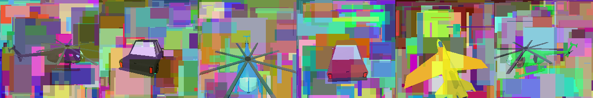

> [!CAUTION]
> This is a work in process, please dont use this in production until the first release.

# open-captcha
Open Captcha stands out from other captcha providers in a big way. Forget about connecting to external services or making your users work for free to train AI. Our approach ensures that each challenge is unique and employs the most advanced anti-ai detection methods, all while being completly self-hosted and intergrated into your web-app.



## Benchmarking

version | os | runs | avg duration
--- | --- | --- | ---
1.1.x | `Linux Lab 5.15.0-94-generic #104-Ubuntu SMP Tue Jan 9 15:25:40 UTC 2024 x86_64 x86_64 x86_64 GNU/Linux` | 500 | 471.937245/ms

To benchmark yourself run the script `npm run benchmark`

## System dependencies
In most cases setting up `open-captcha` from npm should just work. However, since open-captcha uses image rendering you may run into problems and you might need to adjust your system configuration and make sure all your dependencies are up to date.  For general information on building native modules, see the [`node-gyp`](https://github.com/nodejs/node-gyp) documentation.

### Ubuntu / Debian
- [Python 3.x](https://www.python.org/)
- A GNU C++ environment (available via the `build-essential` package on `apt`)
- [libxi-dev](http://www.x.org/wiki/)
- Working and up to date OpenGL drivers
- [GLEW](http://glew.sourceforge.net/)
- [pkg-config](https://www.freedesktop.org/wiki/Software/pkg-config/)

```
sudo apt-get install -y build-essential libxi-dev libglu1-mesa-dev libglew-dev pkg-config python3 python-is-python3
```

### Windows

- [Python 3.x](https://www.python.org/)
- [Microsoft Visual Studio](https://www.microsoft.com/en-us/download/details.aspx?id=5555)
- [d3dcompiler_47.dll](https://www.dll-files.com/d3dcompiler_47.dll.html) should be in c:\windows\system32, but if isn't then you can find another copy in the `deps/` dir

### Mac OS X

- [Python 3.x](https://www.python.org/)
- [XCode](https://developer.apple.com/xcode/)