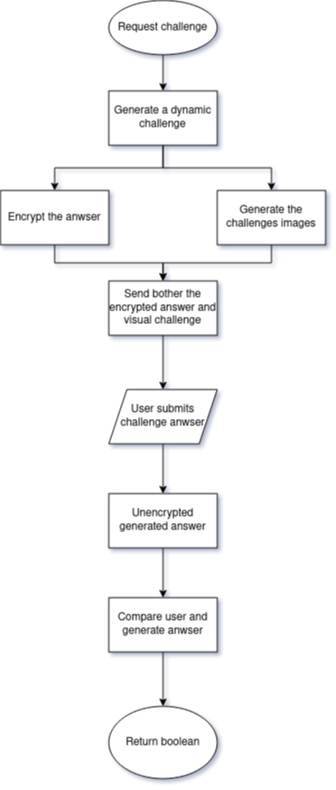

# open-captcha
open source captcha





- Make sure python3 is installed as "python"
```
sudo apt install python-is-python3

// OR Place this into ~/.bashrc or ~/.bash_aliases file:

alias python=python3

```

```
sudo apt-get install libxi-dev
```

```
$ sudo apt-get install -y build-essential libxi-dev libglu1-mesa-dev libglew-dev pkg-config
```

## System dependencies

In most cases installing `headless-gl` from npm should just work.  However, if you run into problems you might need to adjust your system configuration and make sure all your dependencies are up to date.  For general information on building native modules, see the [`node-gyp`](https://github.com/nodejs/node-gyp) documentation.

#### Mac OS X

* [Python 2.7](https://www.python.org/)
* [XCode](https://developer.apple.com/xcode/)

#### Ubuntu/Debian

* [Python 2.7](https://www.python.org/)
* A GNU C++ environment (available via the `build-essential` package on `apt`)
* [libxi-dev](http://www.x.org/wiki/)
* Working and up to date OpenGL drivers
* [GLEW](http://glew.sourceforge.net/)
* [pkg-config](https://www.freedesktop.org/wiki/Software/pkg-config/)

```
$ sudo apt-get install -y build-essential libxi-dev libglu1-mesa-dev libglew-dev pkg-config
```

#### Windows

* [Python 2.7](https://www.python.org/)
* [Microsoft Visual Studio](https://www.microsoft.com/en-us/download/details.aspx?id=5555)
* d3dcompiler_47.dll should be in c:\windows\system32, but if isn't then you can find another copy in the deps/ folder


--- 

```
pip install PyOpenGL PyWavefront pygame
```