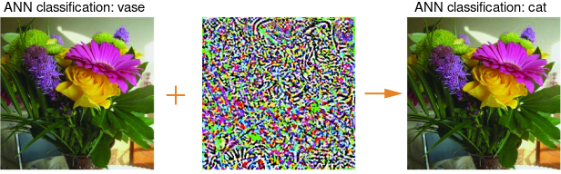

# Adversarial Pattern Technique (APT)

In this [Google DeepMind article](https://deepmind.google/discover/blog/images-altered-to-trick-machine-vision-can-influence-humans-too/), they discuss the use of adversarial images to cause misclassification of images into other categories. This is achieved by exploiting a security vulnerability in ML systems, intentionally leading them to be fooled.

Left: An Artificial Neural Network (ANN) correctly classifies the image as a vase but when perturbed by a seemingly random pattern across the entire picture (middle), with the intensity magnified for illustrative purposes – the resulting image (right) is incorrectly, and confidently, misclassified as a cat.

In this more complex pytorch diagram. it shows a famous [FGSM](https://arxiv.org/abs/1412.6572) panda example

From the figure, $`X`$ is the original input image correctly classified as a “panda”, $`y`$ is the ground truth label for $`X`$, $`θ`$ represents the model parameters, and $`J(θ,X,y)`$ is the loss that is used to train the network. The attack backpropagates the gradient back to the input data to calculate $`∇xJ(θ,X,y)`$. Then, it adjusts the input data by a small step ($`ϵ`$ or $`0.007`$ in the picture) in the direction (i.e. $`sign(∇xJ(θ,X,y))`$ that will maximize the loss. The resulting perturbed image, $`x′`$, is then misclassified by the target network as a “gibbon” when it is still clearly a “panda”.

---

Suggested in issue [#3](https://github.com/NotReeceHarris/open-captcha/issues/3)